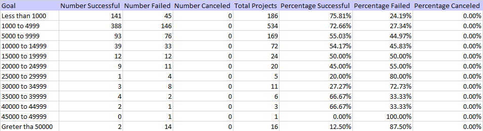
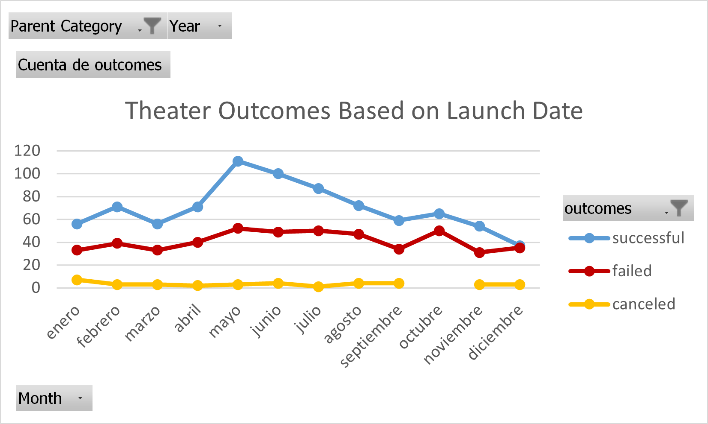

# Kickstarting with Excel

## Overview of Project

The main purpose of this project is to analyze this dataset that contains data about crowdfunding platforms that means that this dataset will provide us with information about different kind of events and how the fundraisers and the backers interact through this platform that is how much money have pledged to the campaigns and even provide us with the outcome of each campaings among other relevant data for our analysis.

## Analysis and Challenges

I think the main challenge was to understand the dataset because if we don't know the sense of the data you can't tell the story of and you can´t explain in a good and understandable way.
Afert undestanding the data we can continue with the analysis, I make a cuple questions first, like:"what was the analysis for? and What is the main purpose of doing this analysis?".

After answering this importat questions everything make sense and we can make a better analysis and tell the story of the data.

A challenge for my was to apply the formula COUNTIF because I'd never use it before, but with the video that explains the parameters of the formula I understood who use it, the others topics were not to complicated because we saw all of them in the platform and in the class.
I add the documentation I used:

[Documentation of COUNTIF](https://support.microsoft.com/en-us/office/countif-function-e0de10c6-f885-4e71-abb4-1f464816df34)

### Analysis of Outcomes Based on Launch Date

### Analysis of Outcomes Based on Goals

## Results

- What are two conclusions you can draw about the Outcomes based on Launch Date?

1. There is a peak of sucessful theater events in May and then we can see that the graf has a fall until december with a minimal recovery in October. The tendency of fail events seems to agree with the tendency of successful events maybe there is a correlation between them, with the exception of the month of December.
2. The canceled events are minimum as we can see, but in the period of September and November there are not canceled events of theater, but at the same time the incresed of fail events can be noticed in October.

- What can you conclude about the Outcomes based on Goals?

We can notice that the percentage of cancel events of the subcategory play is 0 %, and the number of successful event is greater that the failed events in a general view, but we can notice too that the campaigns that has the higher goals are minimum, and most of this failed, in the other way the campaings that has a lower goals are more succesful.

- What are some limitations of this dataset?

One limitation that I see is that we don't kown the name of the backers that gives money to the crowfunding in this events, that is a disadvantage because we can use that information to knows who backers are more interested in one or more specific events and how much money they contribute. With this kind of information we can make a good marketing analysis to know what type of event offer to the different backers and with this reduce the probability of failure.

- What are some other possible tables and/or graphs that we could create?

We can make and analysis about the correlation of the variables failed, successful and cancel to know if is there a common events that make one or other happened.

We can make a graf focus in the number of backers that each event has to know what kind of event is more important for the fundraising.
